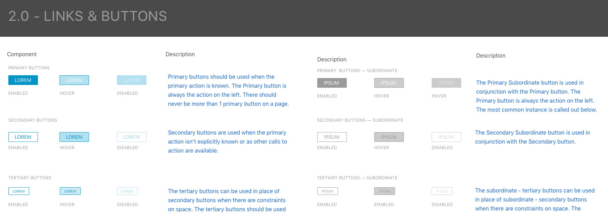
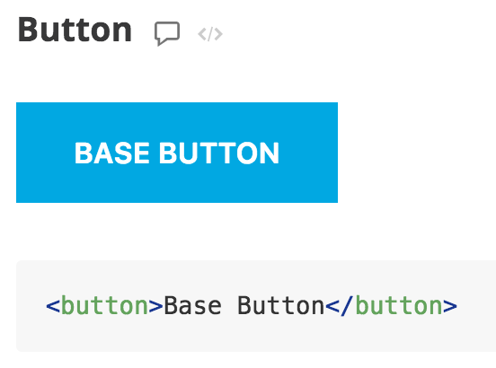
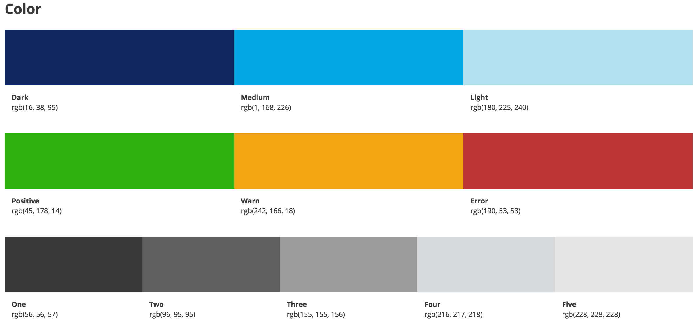
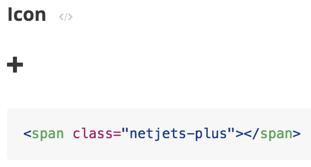
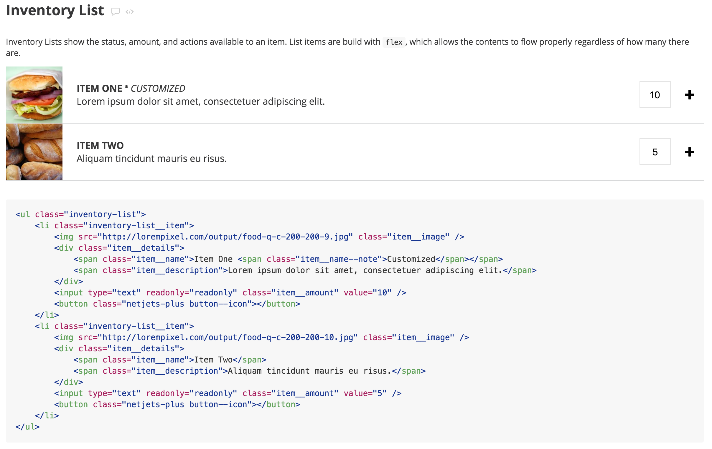
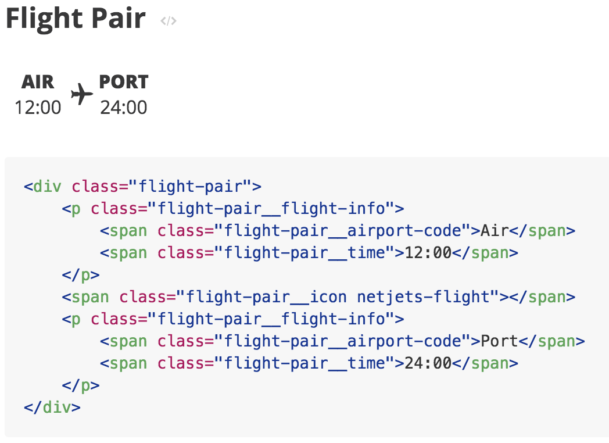

# NetJets User Group

Presented by:

 * Brad Pearson (NetJets)
 * Caitlin Steinert (Base Two)
 * Drew Miller (Base Two)

---

## Outline

 1. Introduction
 2. Building a Living Styleguide
 3. Improving the Developer Experience

---

## Introduction

> Brad has some deep thoughts.

----

### One more thing...

> What did he just say?!

---

Note:
- Hello! 
- I am a UX developer on the Center of Excellence team
- One of my goals as part of this team is to facilitate collaboration and communication between designers and developers as we work together

----

## Living Styleguide

Note:
- One way I'm accomplishing this feat is by spearheading the Living Styleguide initiative

----

## Living Styleguide

 - Creates a common design language

Note:
- Communication is tough, especially across disciplines
- The way that we as developers think of UI components can often differ wildly from how designers think about them
- Lots of emails fly back and forth about padding, font sizes, and colors
- This effects our productivity and can cause friction between teams

----

Note:
- The UX/Marketing team is hard at work generating new and unified designs for the components across applications
- There are a *lot* of components in the suite of applications, so this is an evolving piece of work
- The comps from UX/Marketing won't be the finished product, however...

----

## Living Styleguide

- Creates a common design language
- Compose a UI from the ground up

Note:
- As they create guidelines, we are simultaneously translating them into the Living Styleguide

----

Note:
- This is a screenshot of the Living Styleguide that shows the default styles for a basic button element

----

Note:
- The Living Styleguide is built entirely in HTML, Sass, and Javascript
- The Sass that is applied to the styleguide is the same Sass that can be used in any company app
- The whole package will live on the CDN eventually so that it's accessible to all teams

----

Note:
- The HTML that it's built from is also pulled into the Styleguide so that developers can see what attributes are required...

----

Note:
- ...which becomes especially useful as we group elements into more complex components

----

## Living Styleguide

- Creates a common design language
- Compose a UI from the ground up
- Styleguide-driven development

Note:
So I hear you say, Ok lady, that sounds cool and all, but how's this going to help me in my job, and NetJets in general? How am I even going to use this thing?
Goals of this project include, but are not limited to...

----

Note:
...creating markup and styles that are custom-tailored to the NetJets brand and apps...

----

Note:
...promoting and facilitating the use of the latest and greatest features in HTML and CSS...

----

#### Less of this

Note:
...reducing the amount of repeated work required as apps begin to switch over to the new design...

----

#### More of this

Note:
...and facilitating teamwork and speed. 

---

## Improving the Developer Experience

- Integrating a Styleguide component into your application
- Unlocking the front-end ecosystem with webpack
- A primer on unidirectional data flow with Redux

----

### Integrating a Styleguide component

> Drew has some deep thoughts.

----

### Unlocking the ecosystem

> Thoughts, we've got them.

----

### Unidirectional data flow

> The thrilling conclusion!

---

## Conclusion

> We're around, come say hi (and ask questions)