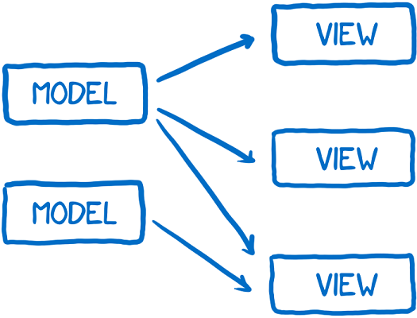
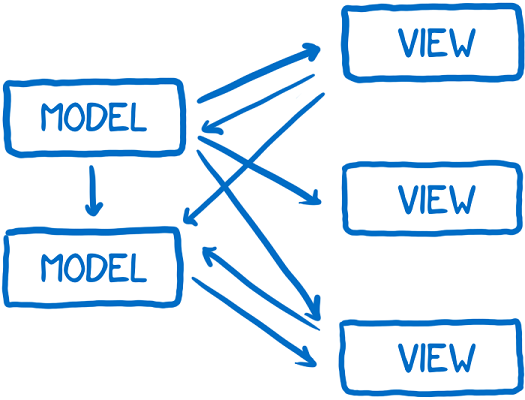

# NetJets User Group

Presented by:

 * Brad Pearson (NetJets)
 * Caitlin Steinert (Base Two)
 * Drew Miller (Base Two)

---

## Outline

 1. Introduction
 2. Building a Living Styleguide
 3. Improving the Developer Experience

---

## Introduction

> Brad has some deep thoughts.

----

### One more thing...

> What did he just say?!

---

## Building a Living Styleguide

 - Using a Styleguide to create a common design language
 - Composing a UI from the ground up
 - What does Styleguide-driven development mean for NetJets

----

### Using a Styleguide

> Caitlin has some deep thoughts.

----

### Composing a UI

> Thoughts, we've got them.

----

### Styleguide-driven development

> The thrilling conclusion!

---

# Improving the Developer Experience

----

## Developer Experience (DX)

Your productivity is a precious commodity; use it wisely.

1. Focus on the task at hand
2. Use purpose-built tools
3. Reduce cognitive overhead

Note: 
- We talk a lot about UX, but let's talk about DX.
- Let's talk about three concepts that help us be better developers.

----

## Focus on the task at hand


----

### How does a Styleguide focus us?

- Styleguide components are just markup and styles
- Behavior comes from the platform implementation
- We get to focus on the behavior, not the presentation

Note: 
- Consume the published styleguide artifacts we can,
- Replicate what we can't consume,
- Enhance with our framework of choice  

----

### Icon Component

```html
<span class="netjets-close"></span>
```

```scss
[class^="netjets-"], [class*=" netjets-"] {
	font-family: 'netjets-icons';
	font-style: normal;
	font-variant: normal;
	font-weight: normal;
	line-height: 1;
	speak: none;
	text-transform: none;
}

.netjets-close::before {
	content: "\e045";
}
```

Note:
- Here's some markup/styles from our Styleguide
- Basic HTML for structure and CSS for presentation

----

### In Angular 2?

```ts
import '@netjets/styleguide/icon.scss';
import { Component, Input } from '@angular/core';

@Component({
  selector: 'nj-icon',
  template: '<span class="netjets-{{name}}"></span>',
})
class IconComponent {
  @Input()
  public name: string;
}

export default IconComponent;
```

Note:
- Implementing that in Angular 2,
- We import the SASS directly,
- We re-use the HTML indirectly

----

### In React?

```js
import '@netjets/styleguide/icon.scss';
import React from 'react';

const Icon = ({ name }) => (
  <span className={`netjets-${name}`}></span>
);

export default Icon;
```

Note:
- And again in React,
- We import the SASS directly,
- We re-use the HTML indirectly
- Someone (Caitlin) has done the heavy lifting for us!

----

### But wait... what?!

```ts
// Annotations?!
@Input()
public name: string;
```

```js
// Importing SASS files?!
import '@netjets/styleguide/icon.scss';
```

```js
// HTML-ish in our JS?!
<span className={`netjets-${name}`}></span>
```

Note:
- Those things aren't normal JavaScript!
- You can't just do that... can you?

----

## Use purpose-built tools


Note:
- When we talk about tools, especially front-end tooling,
- You may be imaging something like this...

----

### webpack


Note:
- There is an amazing diversity of awesome tools out there
- Let's talk about one in particular, webpack
- It's a very _powerful_ tool; which generally means useful and complicated

----

### webpack

```js
var path = require('path');

module.exports = {
  entry: {
    app: './src/app.js',
    vendor: './src/vendor.js',
    polyfills: './src/polyfills.js', 
  },
  output: {
    path: path.join(__dirname, 'dist'),
    filename: '[name].[chunkhash].bundle.js',
  },
  // ...
};
```

Note:
- So what do we have going on here?
- We point webpack at some entry points,
- And we tell it how we want to output them,
- webpack figures out the dependency graph for us.

----

### webpack

```js
module.exports = {
  // ...
  module: {
    loaders: [
      {
        test: /\.jsx?/, // Match files with `.js` or `.jsx` extensions.
        loader: 'babel', // Convert them from ES6 to our target.
      },
      {
        test: /\.tsx?$/, // Match files with `.ts` or `.tsx` extensions.
        loader: 'babel!ts', // Convert them from TypeScript to ES6, etc.
      },
    ],
  },
};
```

Note:
- Now we're in another section of our webpack.config.js file.
- We're telling webpack what types of files we expect to see,
- And what to do with them once we find them.

----

### webpack

- webpack is purpose-built to efficiently build web apps
- It unlocks an entire ecosytem of tools for us to use

Note:
- SASS, TypeScript, ES6, and more...

----

## Reduce cognitive overhead


Note:
- Cognitive overhead? That's a little vague...
- What are we talking about here?

----

### Cognitive overhead

> The logical connections or jumps your brain has to make in order to understand or contextualize the thing you’re looking at.

-David Demaree, Web Designer

Note:
- This quote is in the context of UX.
- But let's talk about DX.
- How much do you have to hold in your head to implement a feature? How about to fix a bug?

----

### In the beginning...



Note:
- So you're starting a greenfield project,
- You've got straightforward use cases,
- Things are going to be great this time!
- Let's describe the flow of data in our system.

----

### In the end...



Note:
- And then, innevitably, we get here...
- Anyone used a lot of two-way data-binding in Angular 1?
- You have a bug over here, but the actual cause is waaaay over there....

----

### Unidirectional data flow

- A lot of complexity is in the flow of our data
- If we can describe that flow more simply, we can reduce cognitive overhead

Note:
- A lot of thought and research has gone into this problem.
- One of the popular solutions is a pattern called Flux; which is Facebook taking an old idea and pretending it's new.

----

### Flux Architecture


Note:
- To sum it up, we have the state of our app in our Store
- That drives how we render our View(s)
- Actions are dispatched which cause mutations in our Store

----

### Flux Architecture


Note:
- You might have Actions coming from a View, or from a background-job, etc
- So whether or not this is really _new_, it's useful.
- If we implement this, we have to hold much less in our heads to make a change.

----

### But we're not using Flux!

- This is just one way to reduce cognitive overhead
- Improve the DX on your project when you can

Note:
- Over the lifetime of a product, maintenance costs dramatically outweigh initial investment.
- Do that developer 2 years from now a favor and make it easy to reason about, easy to enhance, easy to fix.

---

## Conclusion

> We're around, come say hi (and ask questions)