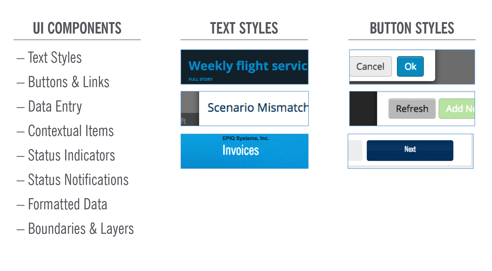
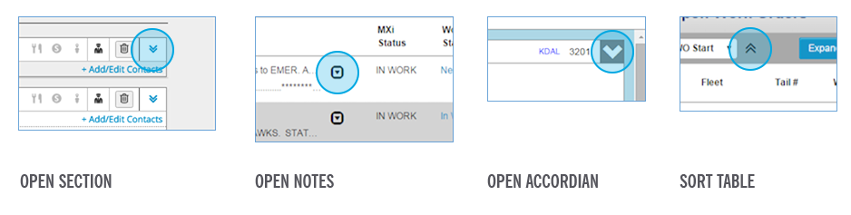
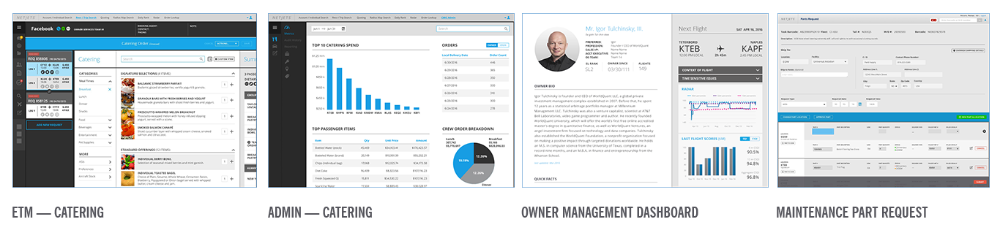
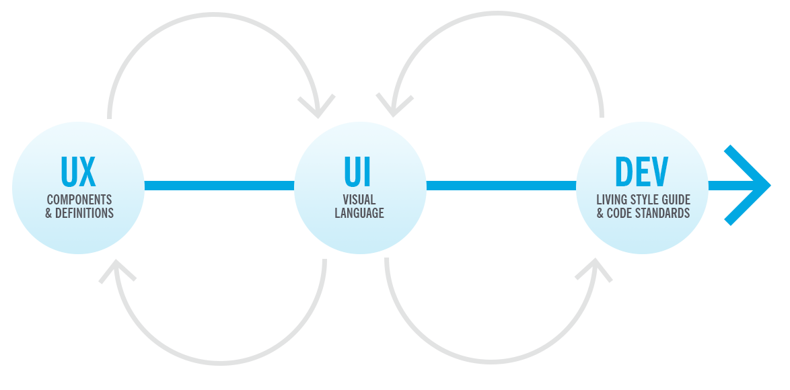
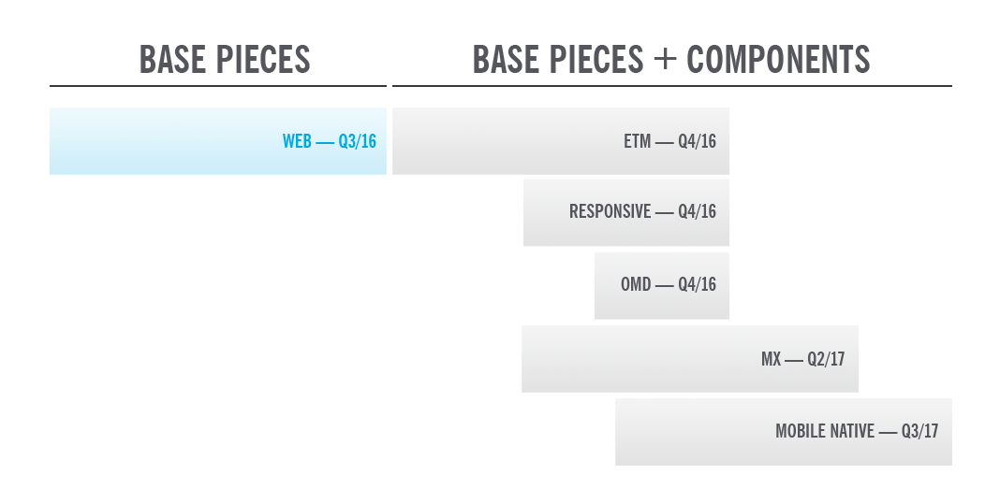
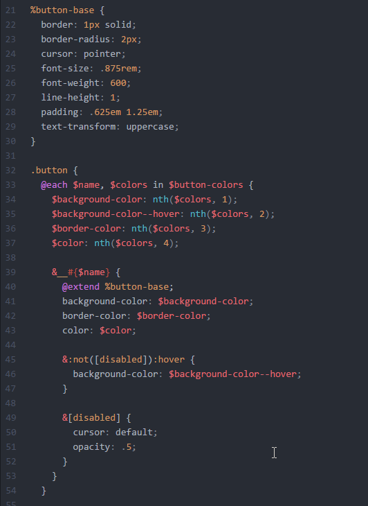
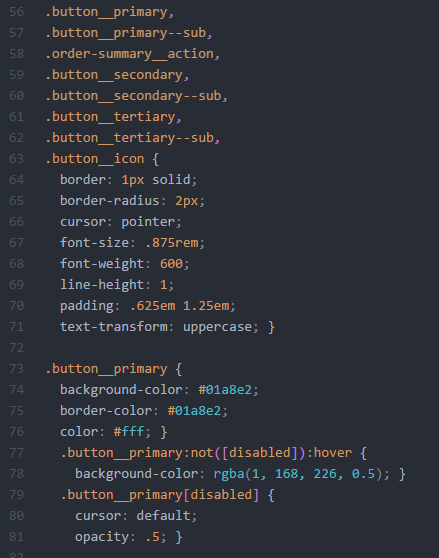
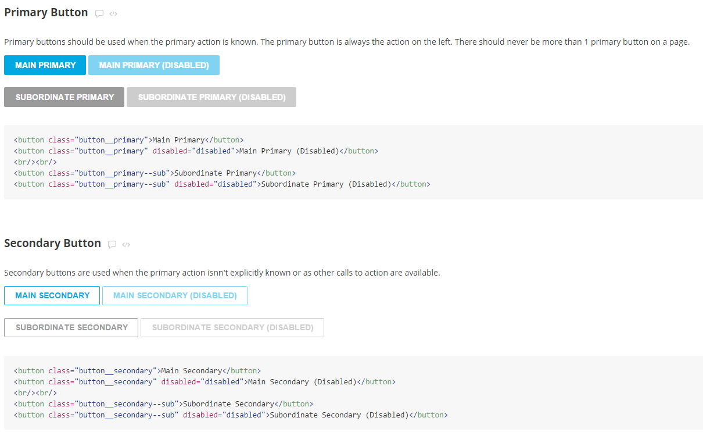
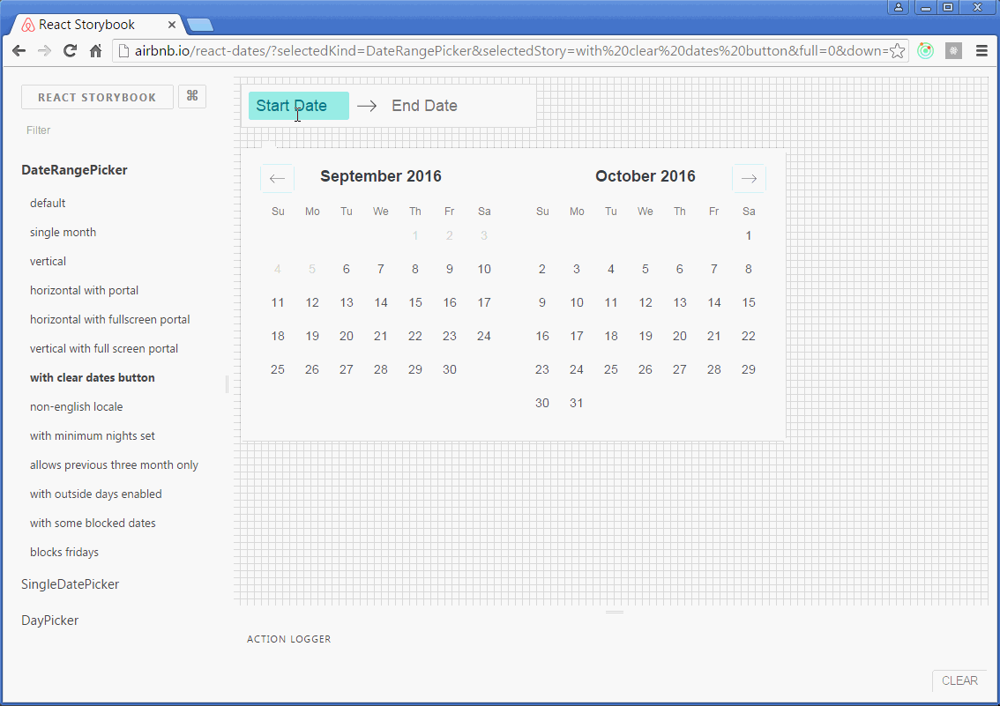
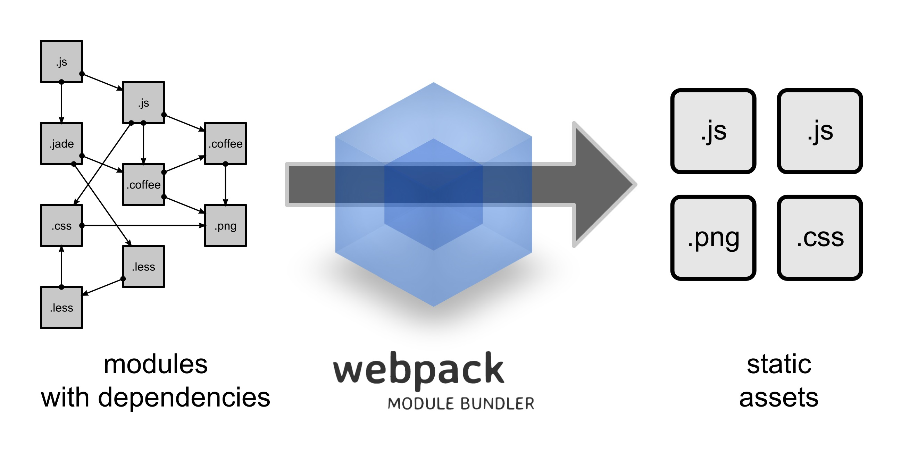

<!-- .slide: data-background="./images/intro-slide-bg.png" data-background-size="cover" -->
# NetJets User Group

Presented by: <!-- .element: class="presented-by" -->

 - Brad Pearson (NetJets) <!-- .element: class="presenter" -->
 - Caitlin Steinert (Base Two) <!-- .element: class="presenter" -->
 - Drew Miller (Base Two) <!-- .element: class="presenter" -->

---

## Introduction

- Future of web development at NetJets <!-- .element: class="fragment" -->
- Web Center of Excellence <!-- .element: class="fragment" -->
- App server to browser <!-- .element: class="fragment" -->

Note:
- Hello everyone, thanks for coming to the user group meeting today
- My name is Brad Pearson - For those who don't know me, I'm a tech lead and I've been working at NJ 4+ years on ETM
- Today, we're going to be talking about the future of web development at NetJets
- Included in that is a new group called the Web CoE
- Web CoE is a group of people who are working to move the state of web development forward
- Domain of CoE is app server to browser in context of web apps - not web services

----

## Web App Development

- 'Web Apps' is a broad category <!-- .element: class="fragment" -->
- 'Single Page Apps' are the complex web apps we develop <!-- .element: class="fragment" -->
- Complexity comes from combination of technologies <!-- .element: class="fragment" -->
- JavaScript isn't JavaScript anymore, CSS isn't CSS anymore, HTML is HTML anymore <!-- .element: class="fragment" -->
- Today's web app development is unique <!-- .element: class="fragment" -->

Note:
- web development is a broad category
- historically it's been lots of different things
- single page apps are the complex apps we spend most time on
- Complexity = JS/TypeScript/ES2016/babel - CSS/LESS/SASS - HTML/NG Directives/JSX/Styleguide components defined in app syntax
- Web app development is a unique niche of software engineering

----

## Web UI CoE

- Why? <!-- .element: class="fragment" -->
  - Space is new and changes happen fast! <!-- .element: class="fragment" -->
  - Because of the unique aspect of web dev <!-- .element: class="fragment" -->
- What? <!-- .element: class="fragment" -->
  - Commit to improvement and staying current <!-- .element: class="fragment" -->
  - Everything is on the table <!-- .element: class="fragment" -->
- How? <!-- .element: class="fragment" -->
  - Tech Radar and POC's <!-- .element: class="fragment" -->
  - Today is just a starting point <!-- .element: class="fragment" -->
  - Wiki, user group meetings, ad hoc meetings <!-- .element: class="fragment" -->

Note:
- The web CoE is about trying to research and implement things here at NJ to make web development better and stay current
- Everything: From frameworks to tools to learning to process
- This work is just the starting point - the web CoE goal is to continue to develop better tools and processes in the web dev space
- Everything is on the table when it comes to how we make web development better
- Ongoing communication about the web CoE initiatives will be via the wiki, future user group meetings as well as ad hoc department meetings
- With that said, there's a lot of work and we decided to partner with experts to help us

----

## Base Two

- Expertise in web development <!-- .element: class="fragment" -->
- JavaScript, HTML, CSS, build process, best practices <!-- .element: class="fragment" -->
- Caitlin Steinert - styleguide and implementation <!-- .element: class="fragment" -->
- Drew Miller - web app development <!-- .element: class="fragment" -->

Note:
- We found and have enlisted the help of a company called Base Two
- Software development agency here in Columbus and they also bought the pizza for today
- The have expertise in core client side web development technologies
- Things like JS, HTML, styling, build processes, best practices
- Today we have two developers from base two who are working on our styleguide as well as the client side app development for etm redesign project
- Introduce Caitlin Steinart and Drew Miller
- Caitlin has been working more with the style side of the project and Drew on the app development side

----

## CoE WHYDFML?

- Tech <!-- .element: class="fragment" -->
  - Styleguide & Storybook <!-- .element: class="fragment" -->
  - Building a new web app stack <!-- .element: class="fragment" -->
- Process <!-- .element: class="fragment" -->
  - Everything starts with UX <!-- .element: class="fragment" -->

Note:
- What have we done so far - lots of technical things that aren't yet ready
- Comes together by all development starting with UX
- Hand it over to James

---

# NetJets Style Guide

> Create a consistent visual language of UI components for use by designers and
developers during the discovery and design phases of NetJets applications.

----

### Internal Systems Audit:
### Visual Language



Note:
For this audit, Contrail, ETM, Flight Control/Flight Release, Line Planning,
MXNet, OCMS, Online Payments, Pulse, and Subscription Center were examined for
usage and styling of the following items.

----

### Internal Systems Audit:
### User Interactions
Consistency and Standards

----

> "Users should not have to wonder whether different words, situations, or
actions mean the same thing."
>
> Jakob Nielson



----

### Implementation Examples

#### Clear Visual Language / Consistent Patterns and Interactions



----

## Process & Workflow

#### Ongoing and Cross Disciplinary



----

## UX/UI Efficiency Gains

How and where will a styleguide help with efficiency?

* Designing from known patterns
* Cross project design
* Streamline QA process

----

## Style Guide
#### Scope & Timeline



---


Note:
- Hello!
- I am a UX developer on the Center of Excellence team
- One of my goals as part of this team is to facilitate collaboration and communication between designers and developers as we work together

----

## Living Style Guide

Note:
- So we just heard from the UX/Marketing team about their initiative to standardize the design experience across apps
- The Center of Excellence team is focusing on standardizing the development experience as well
- My area of expertise is writing clean, semantic, standardized HTML and CSS
- So my contribution to this effort is the creation of a Living Style Guide

----

## Living Style Guide

 - Creates a common design language

Note:
- Communication is tough, especially across disciplines
- The way that we as developers think of UI components can often differ wildly from how designers think about them
- Lots of emails fly back and forth about padding, font sizes, and colors
- This effects our productivity and can cause friction between teams
- My goal is to reduce rework and communication errors by providing interactive documentation (living style guide)

----


Note:
- I'll use buttons as an example of this process.
- So, as the UX/Marketing team continues their work on creating comps...

----



Note:
- ...I am distilling their designs and instructional information into semantic markup and flexible styling
- This is an example of the behind-the-scenes work that will go into creating button styles
- This is written in Sass, which is an industry-standard CSS extension language that adds helpful functionality like variables and functions to speed up and simplify the style-writing process.

----



Note:
- That Sass is compiled into the CSS that will form a base stylesheet that can be used across applications.

----



Note:
- It is also being applied to our Living Style Guide, which shows the CSS in action layered on top of semantic markup
- The Living Style Guide also includes instructional text that details where elements should be used, and when
- This guide will be available to all developers on the CDN (it's actually already there)

----

## Living Style Guide

- Creates a common design language
- Compose a UI from the ground up

Note:
- So those were just the button elements
- Of course, there's a lot more that goes into a user inter interface
- But instead of creating the markup and styles for entire views at a time, we're working on them at the component level

----


Note:
- We start with the basics like buttons, colors...

----


Note:
- ...and icons and work up from there, putting all the pieces together, to form more complex components like...

----


Note:
- ...this inventory list that's being used on the catering review screens.

----

## Living Style Guide

- Creates a common design language
- Compose a UI from the ground up
- Styleguide-driven development

Note:
So I hear you say, Ok lady, that sounds cool and all, but how's this going to help NetJets developers? Why not just use Bootstrap like we have been?
Goals of this project include, but are not limited to...

----


Note:
...creating markup and styles that are custom-tailored to the NetJets experience (in a way that you'd never get out of a general library like Bootstrap)...

----


Note:
...promoting and facilitating the use of the latest and greatest features in HTML and CSS...

----

### Less of this


Note:
...reducing the amount of repeated work required as apps begin to switch over to the new design...

----

### More of this


Note:
...and facilitating teamwork and speed.

----

## Check it out

cdn.netjets.com/libs/netjets-style-toolkit

---

# Improving the Developer Experience

----

## Developer Experience (DX)

Your productivity is a precious commodity; use it wisely.

1. Focus on the task at hand
2. Use purpose-built tools
3. Reduce cognitive overhead

Note:
- We talk a lot about UX, but let's talk about DX.
- Let's talk about three concepts that help us be better developers.

----

## Focus on the task at hand


Note:
- First, let's talk about focus...

----

### How does a Styleguide focus us?

- Styleguide components are just markup and styles
- Behavior comes from the platform implementation
- We get to focus on the behavior, not the presentation

Note:
- Consume the published styleguide artifacts we can,
- Replicate what we can't consume,
- Enhance with our framework of choice

----

### Icon Component

```html
<span class="netjets-close"></span>
```

```scss
[class^="netjets-"], [class*=" netjets-"] {
	font-family: 'netjets-icons';
	font-style: normal;
	font-variant: normal;
	font-weight: normal;
	line-height: 1;
	speak: none;
	text-transform: none;
}

.netjets-close::before {
	content: "\e045";
}
```

Note:
- Here's some markup/styles from our Styleguide
- Basic HTML for structure and CSS for presentation

----

### In Angular 2?

```ts
import '@netjets/styleguide/icon.scss';
import { Component, Input } from '@angular/core';

@Component({
  selector: 'nj-icon',
  template: '<span class="netjets-{{name}}"></span>',
})
class IconComponent {
  @Input()
  public name: string;
}

export default IconComponent;
```

Note:
- Implementing that in Angular 2,
- We import the SASS directly,
- We re-use the HTML indirectly

----

### In React?

```js
import '@netjets/styleguide/icon.scss';
import React from 'react';

const Icon = ({ name }) => (
  <span className={`netjets-${name}`}></span>
);

export default Icon;
```

Note:
- And again in React,
- We import the SASS directly,
- We re-use the HTML indirectly
- The heavy lifting has already been done for us!

----

### It's Alive!



Note:
- Once implemented, we can present the component in an interactive context
- Sometimes you can't really give feedback until you can see and touch a thing
- This technique lets all the stakeholders get to that moment faster

----

### But wait... what?!

```ts
// Annotations?!
@Input()
public name: string;
```

```js
// Importing SASS files?!
import '@netjets/styleguide/icon.scss';
```

```js
// HTML-ish in our JS?!
<span className={`netjets-${name}`}></span>
```

Note:
- Those things aren't normal JavaScript!
- Maybe they're things we wish we could do...
- You can't just do that... can you?

----

## Use purpose-built tools


Note:
- So now let's talk a bit about tools...
- When we talk about tools, especially front-end tooling, you may be imaging something like this...

----

### webpack



Note:
- There is an amazing diversity of awesome tools out there
- Let's talk about one in particular, webpack
- It's a very _powerful_ tool; which generally means useful and complicated

----

### webpack

```js
var path = require('path');

module.exports = {
  entry: {
    app: './src/app.js',
    vendor: './src/vendor.js',
    polyfills: './src/polyfills.js',
  },
  output: {
    path: path.join(__dirname, 'dist'),
    filename: '[name].[chunkhash].bundle.js',
  },
  // ...
};
```

Note:
- So what do we have going on here?
- We point webpack at some entry points,
- And we tell it how we want to output them,
- webpack figures out the dependency graph for us.

----

### webpack

```js
module.exports = {
  // ...
  module: {
    loaders: [
      {
        test: /\.jsx?/, // Match files ending with .js or .jsx
        loader: 'babel', // Convert from ES6 to ES5
      },
      {
        test: /\.tsx?$/, // Match files ending with .ts or .tsx
        loader: 'babel!ts', // Convert from TS to ES6, ES5
      },
    ],
  },
};
```

Note:
- Now we're in another section of our webpack.config.js file.
- We're telling webpack what types of files we expect to see,
- And what to do with them once we find them.

----

### webpack

- webpack is purpose-built to efficiently build web apps
- It unlocks an entire ecosytem of tools for us to use

Note:
- SASS, TypeScript, ES6, and more...

----

## Reduce cognitive overhead


Note:
- Cognitive overhead? That's a little vague...
- What are we talking about here?

----

### Cognitive overhead

> Logical connections or jumps your brain has to make in order to understand or contextualize the thing you’re looking at.

-David Demaree, Product Manager at Adobe

Note:
- This quote is in the context of UX.
- But let's talk about DX.
- How much do you have to hold in your head to implement a feature? How about to fix a bug?

----

### In the beginning...


Note:
- So you're starting a greenfield project,
- You've got straightforward use cases,
- Things are going to be great this time!
- Let's describe the flow of data in our system.

----

### In the end...


Note:
- And then, innevitably, we get here...
- Anyone used a lot of two-way data-binding in Angular 1?
- You have a bug over here, but the actual cause is waaaay over there....

----

### Unidirectional data flow

- A lot of complexity is in the flow of our data
- If we can describe that flow more simply, we can reduce cognitive overhead

Note:
- A lot of thought and research has gone into this problem.
- One of the popular solutions is a pattern called Flux; which is Facebook taking an old idea and pretending it's new.

----

### Flux Architecture


Note:
- To sum it up, we have the state of our app in our Store
- That drives how we render our View(s)
- Actions are dispatched which cause mutations in our Store

----

### Flux Architecture


Note:
- You might have Actions coming from a View, or from a background-job, etc
- So whether or not this is really _new_, it's useful.
- If we implement this, we have to hold much less in our heads to make a change.

----

### "But we're not using Flux!"

- This is just one way to reduce cognitive overhead
- Improve the DX on your project when you can

Note:
- Over the lifetime of a product, maintenance costs dramatically outweigh initial investment.
- Do that developer 2 years from now a favor and make your project easy to reason about, easy to enhance, easy to fix.

---

## Conclusion

- We're here to help!
- Please let us know if you're interested in getting involved in the CoE

----

#### Drop us a line!

> Brad Pearson
> [bpearson@netjets.com](mailto:bpearson@netjets.com)

> Caitlin Steinert
> [csteinert@base2.io](mailto:csteinert@base2.io)

> Drew Miller
> [dmiller@base2.io](mailto:dmiller@base2.io)

----

# Questions?
